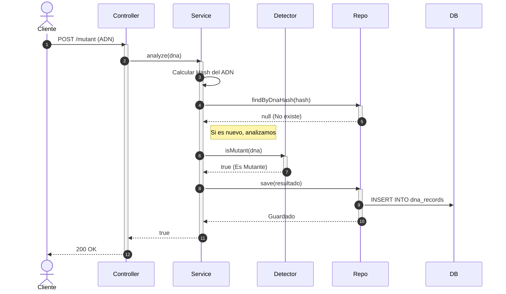
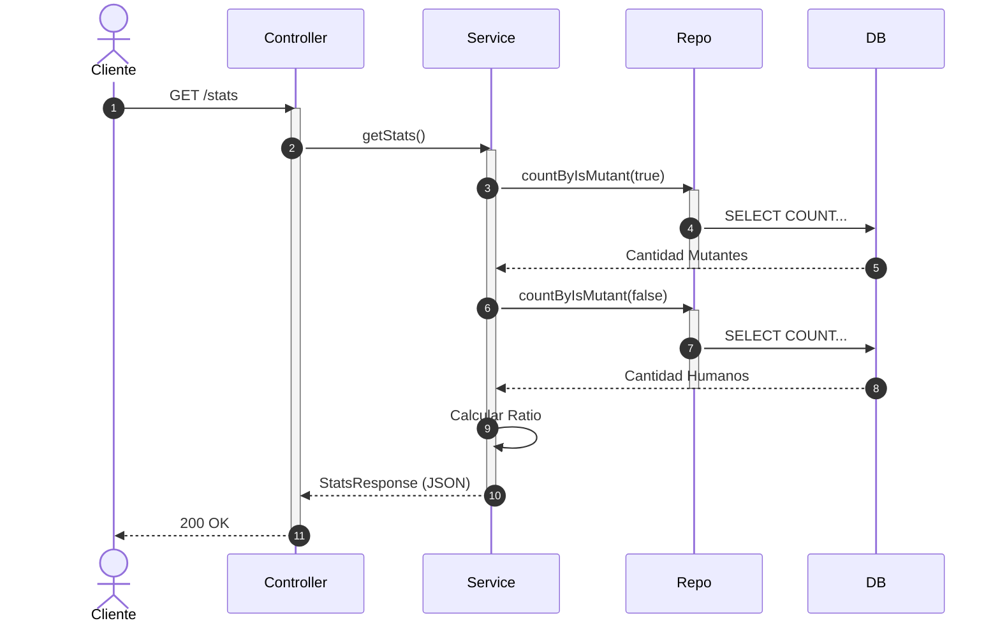

# 🧬 Mutant Detector API


¡Bienvenido al sistema de reclutamiento de Magneto!
Este proyecto es una **API REST** diseñada para detectar si un humano es un mutante basándose en su secuencia de ADN.

El programa analiza una matriz de `NxN` buscando secuencias de **4 letras iguales** (A, T, C, G) en direcciones horizontal, vertical u oblicua.

---

## 🚀 Tecnologías Usadas

El proyecto fue construido siguiendo una arquitectura profesional en capas:

* **Java 17**: Lenguaje principal.
* **Spring Boot 3**: Framework para la API REST.
* **H2 Database**: Base de datos en memoria (SQL) para guardar los análisis.
* **JPA / Hibernate**: Para la comunicación con la base de datos.
* **Lombok**: Para reducir el código repetitivo.
* **Gradle**: Gestor de construcción y dependencias.
* **JUnit 5**: Pruebas unitarias.
* **Swagger (OpenAPI)**: Documentación automática.

---

## 🛠️ Instrucciones de Ejecución

Sigue estos pasos para correr el proyecto en tu computadora:

1.  **Clonar el repositorio** (o descargar el código):
    ```bash
    git clone <TU_LINK_DEL_REPO>
    cd Mutantes
    ```

2.  **Ejecutar el proyecto**:
    * **En Windows:**
        ```powershell
        .\gradlew bootRun
        ```
    * **En Mac/Linux:**
        ```bash
        ./gradlew bootRun
        ```

3.  **Confirmación**:
    Verás un mensaje en la consola indicando que el servidor inició en el puerto 8080.
    > `Tomcat started on port 8080`

---

## 📡 Cómo Usar la API

Una vez que el servidor esté corriendo, puedes probarlo de las siguientes formas:

### 📄 Documentación Automática (Swagger UI)
Puedes probar los botones directamente desde tu navegador entrando a:
👉 [http://localhost:8080/swagger-ui/index.html](http://localhost:8080/swagger-ui/index.html)

### 1. Detectar Mutante (POST)
Envía una secuencia de ADN para analizar.

* **URL:** `http://localhost:8080/mutant`
* **Método:** `POST`
* **Body (JSON):**

```json
{
    "dna": [
        "ATGCGA",
        "CAGTGC",
        "TTATGT",
        "AGAAGG",
        "CCCCTA",
        "TCACTG"
    ]
}
```

* **Respuestas Posibles:**
    * 🟢 **200 OK**: Es un **Mutante**.
    * 🔴 **403 Forbidden**: Es un **Humano**.
    * 🟠 **400 Bad Request**: ADN inválido.

### 2. Ver Estadísticas (GET)
Consulta las estadísticas de las verificaciones de ADN.

* **URL:** `http://localhost:8080/stats`
* **Método:** `GET`
* **Respuesta Esperada:**

```json
{
    "count_mutant_dna": 40,
    "count_human_dna": 100,
    "ratio": 0.4
}
```

---

## 🏛️ Arquitectura y Diagramas

El sistema utiliza un **Controlador** para recibir peticiones, un **Servicio** para la lógica de negocio y validaciones, y un **Repositorio** para guardar los resultados (evitando re-analizar ADNs ya procesados).

### Diagrama de Secuencia: Análisis de Mutante (POST)



### Diagrama de Secuencia: Estadísticas (GET)



---

## 🧪 Testing

El proyecto incluye tests unitarios con **JUnit 5** y **Mockito**.
Para ejecutarlos desde la terminal:

```bash
./gradlew test
```

---
Hecho por **Moyano Elena** - 2024
